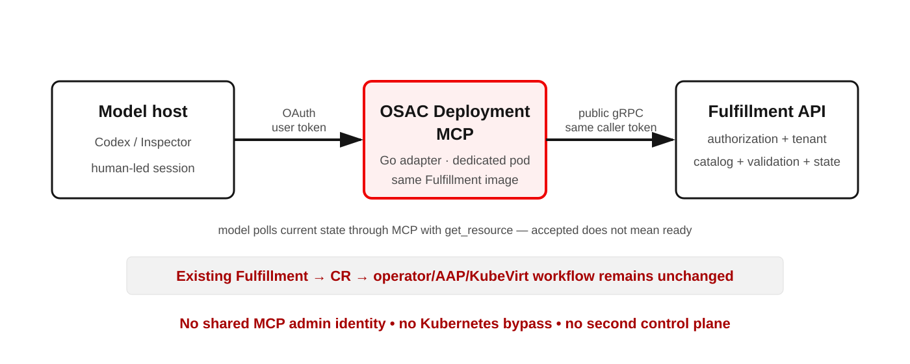

<!-- markdownlint-disable MD001 MD013 MD025 MD033 -->

<!-- _class: title -->
<!-- _paginate: false -->

# OSAC Deployment MCP PoC

### Natural-language ComputeInstance provisioning

OSAC-4388

<!--
Speaker notes — 0:00–0:15
The question was not whether a model can call an API. It was whether a model can
provision through OSAC without bypassing the catalog, tenant identity, or the
existing reconciliation path.
-->

---

## What we set out to prove

Can a model request a VM through MCP while OSAC enforces policy?

The PoC tested whether it could:

- discover a published offering, its defaults, and editable fields;
- act with the caller's tenant permissions;
- submit a request and report asynchronous state accurately; and
- use only explicit, reviewable deployment actions.

> **Why MCP for model hosts?** A remote, OAuth-protected set of discoverable,
> typed actions gives models structured results with less CLI-specific guidance.
> The host needs no local CLI or shell access; Fulfillment still enforces policy.

<!-- _footer: "Scope: [OSAC-4388](https://redhat.atlassian.net/browse/OSAC-4388)" -->

<!--
Speaker notes — 0:15–0:55
The exploration started with cluster provisioning, then pivoted to a
ComputeInstance. VMaaS gave us a focused user-visible workflow while still
exercising catalog policy, storage, networking, identity, reconciliation, and
cleanup. For a remote or restricted model host, MCP exposes a selected set of
typed actions and structured results over OAuth. The host can discover their
schemas instead of relying on extensive CLI-specific agent instructions, and
it need not install the CLI, grant shell access, or parse terminal output. A
model with shell access can use the OSAC CLI too; the CLI remains the broad
interface for people and scripts. MCP does not add backend capability or make
the CLI obsolete. Both paths reach Fulfillment, which enforces the same tenant
and catalog policy. This is the provisioning lane; it is distinct from the
proposed Observability MCP.

In API terms, catalog field policies define locked and editable values plus
defaults. The user supplies permitted configuration; they do not override the
catalog policy itself.

If asked what "OSAC enforces policy" means: MCP validates and forwards the
caller's OAuth token to the public Fulfillment API; it does not act as an admin
or make a separate authorization decision. Fulfillment checks the caller's
allowed operations and tenant. This MCP tool requires a catalog item;
Fulfillment verifies it is visible and published, applies its locked fields
and defaults, and validates the instance type, image, storage tier, subnet,
and security-group references. The model asking for confirmation is part of
this demo's workflow, not yet a server-enforced approval gate.
-->

---

## Existing OSAC boundaries stay in charge

<!--
Speaker notes — 0:55–1:45
The implementation is mostly a protocol adapter. It exposes a curated,
model-friendly tool surface, translates those calls into the existing generated
Fulfillment protobuf API, and forwards the user's identity. Fulfillment remains
the system of record and the enforcement point.

The MCP code is a Go `fulfillment-service start mcp-server` subcommand. Its
Deployment uses the same Fulfillment service image but runs in a separate pod
with its own Service and serving certificate. The image is version-matched to
Fulfillment while the MCP process has a separate rollout.

The downstream contract is deliberately the public Fulfillment API, even
though the gRPC connection is cluster-local. That makes MCP behave like another
tenant client: it receives the same authentication, authorization, tenant,
catalog, validation, and lifecycle semantics instead of acting as a privileged
internal integration or coupling to private control-plane contracts.

The MCP validates and forwards the caller's bearer token on every tool call.
Fulfillment remains authoritative for authorization, tenant isolation, catalog
policy, validation, and lifecycle state. Everything after the API—database,
reconciliation, CRs, operator, AAP, KubeVirt, and feedback—is the existing OSAC
workflow. The model polls current state with get_resource; it never receives an
admin identity or talks directly to Kubernetes or AAP. In the demo, MCP runs
alongside OSAC, reaches Fulfillment through cluster DNS, and mounts
cluster-managed CA and serving-certificate material. The external model host
must still trust the MCP endpoint's serving CA.
-->

---

<!-- _class: tools -->

## Four tools, one governed workflow

| Tool | Purpose | Contract |
| --- | --- | --- |
| `list_resources` | Discover catalog, sizing, storage, networks, and VMs | Read-only, allowlisted, bounded |
| `get_resource` | Inspect references, policy, and current state | Read-only and idempotent |
| `create_compute_instance` | Submit a catalog-mediated VM request | Typed options; asynchronous |
| `delete_compute_instance` | Explicitly clean up one VM | Destructive; explicit ID; idempotent |

**Why this shape?** Compact generic discovery keeps model context small;
purpose-specific mutations preserve precise schemas and accurate risk hints.

<!--
Speaker notes — 1:45–2:25
The model can list and get nine deployment-focused resource types, including
catalog items, instance types, storage tiers, subnets, and security groups. It
can select existing networking, but it cannot create arbitrary networking or
invoke arbitrary fulfillment methods.
-->

---

<!-- _class: demo -->

## Recorded demo — an ordinary user request

> Show me the available Linux VM options and networks. Recommend the smallest
> VM on the isolated demo network, explain your choices, and wait for my
> confirmation before creating it.

Watch for the model to:

1. discover the offering, size, subnet, and security group;
2. explain catalog defaults and which fields can be configured, then request confirmation;
3. create the VM, report state accurately, and poll with `get_resource`; and
4. delete it only after a separate explicit request.

<!--
Speaker notes — 2:25–5:00
Play the recording here. The prompt intentionally does not say "use MCP."
Repository and server guidance route supported tenant deployment work through
the connected OSAC Deployment MCP. Pause briefly when the model asks for
confirmation and when the returned state shows that request acceptance is not
the same as VM readiness. This demonstrates a human-led confirmation flow; the
server does not yet enforce a confirmation transaction.
-->

---

<!-- _class: conclusion -->

## Recommendation: graduate the PoC into a Feature

**Demonstrated:** a model can discover catalog choices, submit a
ComputeInstance request, observe its status, and delete the resource through
the caller's identity and Fulfillment policy.

**Productize next:**

1. **Expand catalog coverage:** add discovery and typed lifecycle tools for
   more catalog-backed resource types.
2. **Govern mutations:** audit and correlate MCP actions; define confirmation
   and dry-run behavior.
3. **Support real clients:** provide durable operation IDs, structured errors,
   tested OAuth onboarding, hosting, and HA.

**Boundary:** this demo selects existing network and storage prerequisites.
Creating networks needs a separate governed workflow.

<!--
Speaker notes — 5:00–6:15
The PoC demonstrates OAuth in the tested model clients, token forwarding to
the public Fulfillment API, discovery of catalog-controlled choices, and
catalog-mediated create, status polling, and delete. A successful create means
the request was accepted; it does not prove the VM reached Ready. The model
selects a pre-seeded network, subnet, and security group. Storage,
virtualization, AAP publication, and tenant defaults are prepared prerequisites.

I recommend a Feature that extends this interface across catalog-backed
resource types. ComputeInstance alone does not show whether the tool shape
generalizes. OSAC also has catalog items for clusters and bare metal; their
user-facing provisioning paths differ, so prioritize each workflow by user
demand and platform readiness. Expansion is the next product capability, while
auditability, confirmation policy, and reliable operation tracking are
requirements for a supported rollout. Specify client onboarding, hosting,
HA, and compatibility as part of that work. Fulfillment remains responsible
for catalog, tenant, and quota policy. Network creation would require a
separate OSAC workflow with ownership, rollback, and cleanup.

If asked about catalog expansion: take one catalog-backed journey at a time,
such as a cluster or bare-metal instance. For each, verify that the public
Fulfillment API supports the needed discovery, selectable inputs, create,
status, and cleanup operations; then expose a small set of typed MCP actions
and test tenant isolation and asynchronous failure reporting end to end. Keep
generic discovery where useful, but do not mirror every Fulfillment RPC as a
tool or assume ComputeInstance inputs fit other resource types.

If asked about governing writes: today's tool descriptions and risk
annotations describe intent to hosts; they are hints, not an approval or
authorization boundary. The server does not enforce a separate human approval
step. Define which actions require approval and where that approval
is enforced. A preview/dry-run should reuse Fulfillment validation to show
resolved defaults, rejected inputs, and likely effects without persisting a
resource; MCP should not duplicate catalog policy. Correlate an audit record
across the MCP request and Fulfillment lifecycle using caller, tenant, tool,
catalog item, target resource, and outcome, without logging tokens or secrets.

If asked about client readiness: create currently returns a resource ID and
initial state, and the host polls `get_resource`. Decide whether that ID is a
sufficient durable tracking handle or whether some workflows need a distinct
operation ID; make failure reasons and retry behavior clear either way. Test
OAuth discovery, client registration/callbacks, scopes, token refresh, and CA
trust with each supported model host. For a supported service, also test
certificate rotation, health checks, restarts, multiple replicas, and MCP SDK
compatibility instead of assuming the demo deployment covers them.

If asked about networking: the demo chooses existing, seeded resources.
Creating a network would be its own governed workflow with ownership,
validation, rollback, and cleanup; it should not be hidden inside VM creation.
-->
