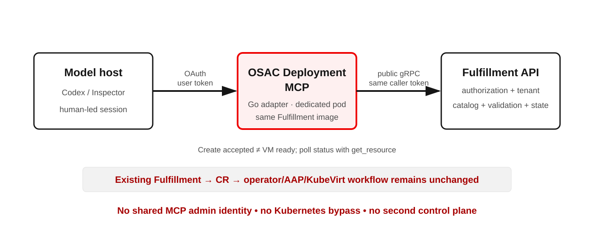

<!-- markdownlint-disable MD001 MD013 MD025 MD033 -->

<!-- _class: title -->
<!-- _paginate: false -->

# OSAC MCP Server PoC

### Natural-language ComputeInstance provisioning

OSAC-4388

<!--
Speaker notes — 0:00–0:20
Spoken: The goal of this PoC was to prove that a tenant user could ask for a VM in natural language and have MCP submit it through our existing Fulfillment API using their token. MCP stands for Model Context Protocol, a standard way for model hosts to discover and call tools.
-->

---

## What we set out to prove

Can a model request a VM through MCP while OSAC enforces policy?

The PoC tested whether it could:

- discover a published offering, its defaults, and editable fields;
- act with the caller's tenant permissions;
- submit a request and report asynchronous state accurately; and
- invoke named, schema-defined deployment actions.

> **Why MCP for model hosts?** A remote, OAuth-protected set of discoverable,
> typed actions gives models structured results with less CLI-specific guidance.
> The host needs no local CLI or shell access; Fulfillment still enforces policy.

<!-- _footer: "Scope: [OSAC-4388](https://redhat.atlassian.net/browse/OSAC-4388)" -->

<!--
Speaker notes — 0:20–0:55
Spoken: The model has to find a published VM offering and look at the available size, storage, and network options. MCP gives it a small set of actions without needing the OSAC CLI on the model host. The only agent guidance we added is a short rule to prefer the connected OSAC MCP tools; the tools and live OSAC data supply the details. Fulfillment still checks what the signed-in user is allowed to do.

Backup — if asked:

The OSAC CLI can reach the same backend and remains useful for people and scripts. MCP's advantage for a remote or restricted model host is discoverable schemas and structured results with less CLI-specific guidance. This is the provisioning lane, distinct from the proposed Observability MCP.

Agent guidance: This repo has one short deployment-specific `AGENTS.md` rule: prefer the connected OSAC MCP tools for supported tenant requests, inspect catalog choices before creating, and do not silently switch to CLI. The MCP server also advertises brief instructions and each tool's description, typed inputs, and behavior hints. The read tools return today's actual offerings and selectable references. We did not put a per-command OSAC CLI playbook into the host's instructions. This is less guidance, not zero guidance, and different model hosts may use it differently.

Catalog field policies define locked and editable values plus defaults. Users supply permitted configuration; they do not override catalog policy. Fulfillment checks the caller's allowed operations and tenant, verifies the catalog item is visible and published, applies defaults and locked values, and validates selected references.
-->

---

## Existing OSAC boundaries stay in charge

<!--
Speaker notes — 0:55–1:45
Spoken: This is a small Go adapter, not a new control plane. It runs in its own pod using the Fulfillment image. It turns tool calls into requests to the public Fulfillment API and forwards the user's token. From there, OSAC follows the same controller and provider path it already uses. There's no admin shortcut or direct Kubernetes access. A successful create call just means OSAC accepted the request; the model still has to check the VM's actual status.

Backup — if asked:

The MCP process is the `fulfillment-service start mcp-server` subcommand, with its own Service and serving certificate. Using the public Fulfillment API over a cluster-local gRPC connection makes MCP behave like another tenant client rather than a privileged internal integration. The separate Deployment allows an independent rollout while keeping its image version matched to Fulfillment.

The MCP validates the incoming bearer token and forwards it on tool calls. Fulfillment remains the system of record and enforcement point. After the API, the existing database, reconciliation, CR, operator, AAP, KubeVirt, and feedback path takes over. The model can poll current state with `get_resource`. The MCP pod uses cluster DNS and cluster-managed CA and serving-certificate material; an external model host still needs to trust the MCP serving CA.
-->

---

<!-- _class: tools -->

## Four tools, one governed workflow

| Tool | Purpose | Key behavior |
| --- | --- | --- |
| `list_resources` | Discover catalog, sizing, storage, networks, and VMs | Read-only; allowlisted; paginated |
| `get_resource` | Inspect references, policy, and current state | Read-only; resource type + ID |
| `create_compute_instance` | Submit a catalog-mediated VM request | Catalog item required; typed inputs; asynchronous |
| `delete_compute_instance` | Explicitly clean up one VM | ID-scoped; destructive; asynchronous |

**Why this shape?** Compact generic discovery keeps model context small;
purpose-specific mutations preserve precise schemas and accurate risk hints.

<!--
Speaker notes — 1:45–2:25
Spoken: We kept the tool list short. The two read tools can look up nine specific resource types, including catalog items, VM sizes, images, storage tiers, networks, and existing VMs. Create and delete are separate actions with their own inputs. This isn't a general-purpose proxy into Fulfillment, and network creation isn't part of this demo.

Backup — if asked:

MCP tool annotations: `list_resources` and `get_resource` are marked read-only and idempotent; create is non-idempotent; delete is destructive and idempotent. All four declare `openWorldHint=false`. Why is that useful? When a model host discovers the tools, it gets these behavior hints alongside their schemas. It can use them to tell lookups from changes, flag that delete is destructive, and avoid treating create as safe to retry. Otherwise it has to infer those properties from names and descriptions. Hosts may use the hints differently; they are not guarantees or permissions. Fulfillment still checks the caller's permissions.

Deletion: It is asynchronous. A repeat request after the resource is gone can return `NotFound`.
-->

---

<!-- _class: demo -->

## Recorded demo

> <a href="https://drive.google.com/file/d/1boI9cFBGApCeNfvQYT4Tojr163KseNhC/view?usp=sharing" target="_blank" rel="noopener noreferrer">Watch the OSAC MCP Server PoC →</a>

<!--
Speaker notes — 2:25–5:55
Spoken: Here's the recording. Watch the model find options, ask before creating, and report the status OSAC actually returns.

Presenter cue: Open the 3:20 recording in a new tab, then return to the deck. It also shows explicit deletion.

Backup — if asked: The link is accessible to company employees. The slide avoids a fixed prompt checklist so narration follows the recording. If creation is accepted but the VM is not Ready, distinguish those states.
-->

---

<!-- _class: conclusion -->

## Recommendation: graduate the PoC into a Feature

**Demonstrated:** a model can discover catalog choices, submit a
ComputeInstance request, observe its status, and delete the resource through
the caller's identity and Fulfillment policy.

**Productize next:**

1. **Broaden workflows:** add more catalog-backed offerings and design
   a separate network-creation workflow.
2. **Govern mutations:** audit and correlate MCP actions; define confirmation
   and dry-run behavior.
3. **Harden delivery:** make setup and login repeatable across supported
   model hosts; make failures actionable and test hosting and HA.

**Boundary:** this demo selects pre-seeded network and storage prerequisites;
it does not create networks.

<!--
Speaker notes — 5:55–7:10
Spoken: My recommendation is to turn this into a Feature. The demo uses networking and storage we set up ahead of time; the model can select them, but these tools don't create them. First, add more catalog-backed offerings and design network creation as a separate workflow. Second, decide how to audit and confirm actions that create or delete resources, including whether we need a dry run. Third, make setup and login work reliably beyond this prepared demo. We can already check a VM's status by ID, so I wouldn't start with another tracking API.

Backup — if asked:

Capability scope: ComputeInstance alone does not prove the tool shape generalizes. OSAC also has catalog items for clusters and bare metal, but their provisioning paths differ. Prioritize each by user demand and platform readiness. For each journey, verify that the public Fulfillment API supports discovery, selectable inputs, create, status, and cleanup; then expose a small set of typed MCP actions. Keep generic discovery where useful, but do not mirror every Fulfillment RPC as a tool.

Network creation needs its own workflow, not a hidden side effect of VM creation. A VM selects existing, ready networking; creating a network makes separate tenant-visible choices about address space and optional firewall rules, and spans several asynchronous writes. The public Fulfillment API already supports those resources and validates CIDR format, network-class compatibility, subnet containment and overlap, and attachment readiness. MCP should use those rules rather than duplicate them, and show the user each proposed create and its outcome. Today's MCP can inspect existing networking but cannot discover NetworkClasses or create network resources.

The create order is: discover a platform-provided NetworkClass; create a VirtualNetwork with a CIDR and wait for READY; create a Subnet inside that CIDR and, if needed, a SecurityGroup on the same VirtualNetwork. Subnet and SecurityGroup are siblings, so neither has to be created before the other, but the selected Subnet and any selected SecurityGroup must be READY before a VM can use them. Then create the VM with those references. A future MCP flow must handle partial failure and distinguish newly created resources from shared ones. For cleanup, delete this VM first, then any owned SecurityGroup, Subnet, and VirtualNetwork in that order, checking for other references before each deletion; backend guards prevent deleting a Subnet while a SecurityGroup remains on its network or deleting a VirtualNetwork while children remain. Never remove shared networking merely because one VM was deleted.

Mutation governance: Define which actions that create or delete resources need human confirmation and where to enforce it. A preview or dry-run should reuse Fulfillment validation to show resolved defaults, rejected inputs, and likely effects without persisting a resource. Test tenant isolation, and correlate MCP and Fulfillment audit records by caller, tenant, tool, catalog item, resource, and outcome without logging tokens or secrets.

Delivery readiness: Create returns a resource ID and initial state, and the host polls `get_resource`; that is sufficient for this VM demo. Make terminal failure reasons and retry guidance clear without assuming every workflow needs a separate operation ID. For a fresh supported model host, verify CA trust, OAuth metadata discovery, the configured client and callback, login through Keycloak, an authorized tool call, and token refresh. Test bad callbacks, invalid scopes, and expired tokens. For the server, test certificate rotation, health checks, restarts, multiple replicas, and MCP SDK compatibility.
-->
